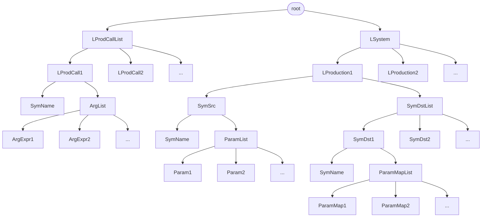
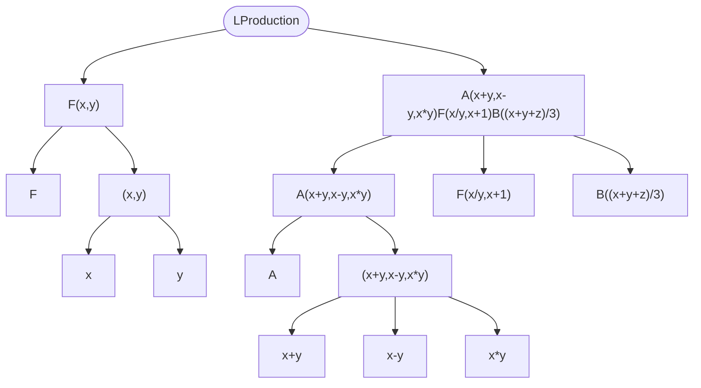

# L-System简介

  

Lindenmayer System，简称L-System，一种字符串并行重写系统，由匈牙利植物学家Aristid Lindenmayer在其1968研究关于生长发育过程中细胞交互作用的数学模型[[1]](#参考链接)中使用的形式文法，后发展出一套形式体系，广泛用于各类生物的形态模拟，以及自相似形体的生成。

Lindenmayer的继任者Prusinkiewicz在1992年著有 _The Algorithm Beauty of Plants_ [[2]](#参考链接)一书，展示了许多精美的植物生成结构。

本项目基于C++17标准的lexy库[[3]](#参考链接)，实现带参数、确定性、上下文无关L-System解析生成器。


<br/>

### 参考链接
[1]. [Mathematical models for cellular interactions in development I. Filaments with one-sided inputs](https://doi.org/10.1016/0022-5193(68)90079-9)

[2]. [The Algorithm Beauty of Plants](http://algorithmicbotany.org/papers/abop/abop.pdf)

[3]. [lexy: C++ parsing DSL](https://lexy.foonathan.net/)


<br/>


# 文档

## 使用示例

### 方式1

```c++
#include "LSystem.hpp"
using namespace std;
int main(int argc, char** argv) {
    LSystem::D0L_System lsys("A(4,5)F(1,2,3)B(4)", "F(x,y,z)->A(x+z,y-x)F(x-2,z-3,y-1)B(y/2)\\nA(x,y)->B(x/2)A(y/2,x/2)B(y+1)");
    for (int i = 0; i < 3; i++)
        cout << lsys.next() << endl;
    return 0;
}
```

### 方式2

```c++
#include "LSystem.hpp"
using namespace std;
int main(int argc, char** argv) {
    vector<string> prods = {
        "F(x,y,z)->A(x+z,y-x)F(x-2,z-3,y-1)B(y/2)",
        "A(x,y)->B(x/2)A(y/2,x/2)B(y+1)"
    };
    LSystem::D0L_System lsys("A(4,5)F(1,2,3)B(4)", prods);
    for (int i = 0; i < 3; i++)
        cout << lsys.next() << endl;
    return 0;
}
```

### 输出结果

```shell
B(2)A(2.5,2)B(6)A(4,1)F(-1,0,1)B(1)B(4)
B(2)B(1.25)A(1,1.25)B(3)B(6)B(2)A(0.5,2)B(2)A(0,1)F(-3,-2,-1)B(0)B(1)B(4)
B(2)B(1.25)B(0.5)A(0.625,0.5)B(2.25)B(3)B(6)B(2)B(0.25)A(1,0.25)B(3)B(2)B(0)A(0.5,0)B(2)A(-4,1)F(-5,-4,-3)B(-1)B(0)B(1)B(4)
```

## 语法结构



### LProduction示例

`F(x,y) -> A(x+y,x-y,x*y)F(x/y,x+1)B((x+y+z)/3)`


