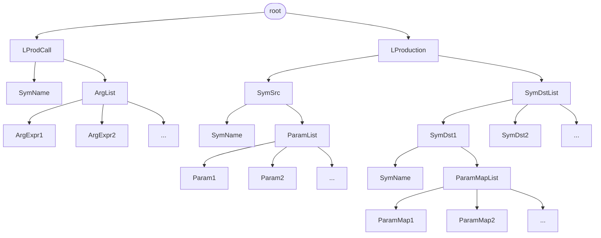
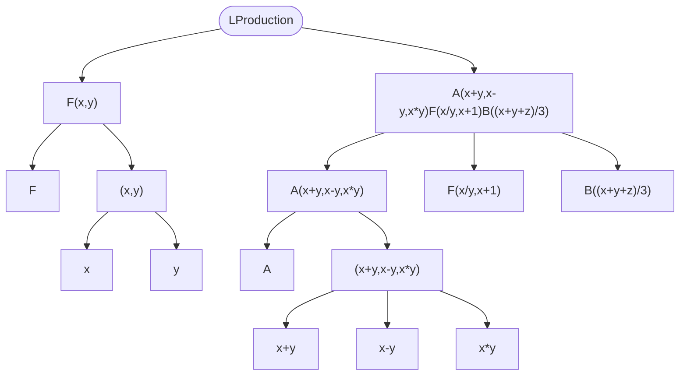

# 开发日志

## 前期类设计

首先，对LSystem的初始化，需要注册所有会用到的变量名，例如这里的 `F` 就是变量名

为LSystem类添加一个 `string iterate(const string &p)` 的方法，这个方法用于对字符串进行迭代计算

增加`string tmp` 用来存储中间量，增加 `string next()` 方法用于调用 `iterate` 更新 `tmp` 并返回，增加 `void reset()` 方法用于重置 `tmp` 以及其他所有迭代过程中可能的状态量

但是这么做，显得 `iterate()` 太过独立，但它要做的事相当明确，就是由一个输入串，根据LRule进行替换，生成新串。将 `iterate()` 独立出来的好处，是可以通过将其指定为虚函数，以派生不同规则的LSystem子类

## 前期头脑风暴

D0LSystem的 `iterate()` 实现

将Production拆解为两个部分，与map的命名保持一致，左半部分称为 `key`，右半部分称为 `value`

`key`的语法，先举个例子，它可以是 `F(0, 1, 2, 3, 4.3)AC(3, 1.1, 2)`

其中 `F` 有5个参数，参数数量这是确定的，在最开始的 `Varname` 中就已经定义好的。后面紧跟的 `A` 可能存在歧义，它可能是一个无参数的独立变量，也可能是一个带3参数的名为 `AC` 的变量，区分它们的方法也是看 `Varname` 中的定义

如此分析，每个在 `Varname` 出现的变量都应该表示成一个函数，但是解析的函数应该如何在代码中实现？首先，它由一个函数名，和若干参数构成，两者是一体的，不能分开写，因此上文中的 LRule 的定义就不合适，应当用一个字符串整体来定义，就像matlab的 `function res = xxx()` 这样，我可以将它的语法规定为比如 `xxx(x, y, ...) -> yyy(y, x, ...)zzz(0.1x, 0.2y)`

注意到这个语法的特点，`key` 部分只有一个带参符号，但是 `value` 部分可以由多个带参符号构成，这类文法应该有个名字，可能叫 `LL(1)` 型文法，需要搜索了解一下

注意到一个问题，varname和production中对于符号的唯一性管理，对于一个带参数的符号，它应当是在production中进行具体的参数映射的定义，但是它同时也应该在varname中进行声明，以保证它和不带参数的符号不会发生冲突

重新考虑了一下，将varname直接删去，LSystem类直接通过解析LRule中的 `key` 来注册所有非终结符号1。但这么做的话，需要另外设计一个用于最终渲染的解析器。


先整理一下 `key` 部分的语法格式。首先，它只包含一个符号，这个符号可以带参数，也可以不带参数

注册符号表似乎不需要传递额外的参数，只需要解析 `LRule` 的 `key` 即可


## 语法规则整理

### 解析L-System产生式的语法设计和命名

参考例子： `F(x,y) -> A(0.1*x,0.2*y,x-y)F(x-y,x+y)B((x+y)/2)`

`Sym` : 产生式的左半部分，以 `SymName` 开头并紧跟一个可为空的 `(` `ParamList` `)`

`SymName` : `Sym` 的名称部分，以字母、下划线开头，后续字母、数字、下划线的组合

`ParamList` : 由圆括号包裹任意数量个 `ParamItem` 构成

`ParamItem` : 符号的参数项，指定 `Sym` 的形式参数名，以字母、下划线开头，后续字母、数字、下划线的组合

`SymMap` : 产生式的右半部分，同样以 `SymName` 开头但紧跟一个可为空的 `(` `ParamMappedList` `)`

`ParamMappedList` : 左侧形式参数映射到的右侧的参数列表，以 `,` 为分隔符，每项为 `MathExpr`

`MathExpr` : 数学表达式，其最小构成单元为 `ParamItem`、`Number`、 带括号的嵌套 `MathExpr` 

`SymMapList` : 多个 `SymMap` 的无分隔符拼接

`LProduction` : 完整的L-System产生式，由 `->` 左侧的 `Sym` 和右侧的 `SymMapList` 构成

### Cpp-Lexy的实现思路


## 构建语法树


在lexy中，表达式产生式继承自 `lexy::expression_production` ，在这个结构下，将各类运算分别用以下基类派生
1. `dsl::infit_op_left` : 从左向右结合的运算，例如 (a ? b) ? c
2. `dsl::infit_op_right` : 从右向左结合的运算，例如 a ? (b ? c)
3. `dsl::infix_op_single` : 双目运算，与1,2相区别，遇到 a ? b ? c 的情况会报错
4. `dsl::infix_op_list` : 需要手动指定结合方式的运算
5. `dsl::prefix_op` : 前缀单目运算，例如 ? a
6. `dsl::postfix_op` : 后缀单目运算，例如 a ?

表达式产生式需要通过 `operation` 成员来指定最低优先级运算，并和其他自定义产生式一样有 `value` 成员来构造解析结果

---

目前，`LProduction` 为L-System生成式解析得到的封装类，但尚未实现其调用逻辑
```cpp
struct LProduction {
    string name;
    Sym sym;
    SymMap smap;
    LProduction(string &name, Sym &sym, SymMap &smap):name(name),sym(sym),smap(smap){}
};
```
其由产生式名称 `name` ，产生式左部签名 `sym` 和右部映射目标 `smap` 构成

```cpp
struct Sym {
    string sym_name;
    optional<vector<string>> params;

    Sym()
        : sym_name(""), params({}) {}
    Sym(const string& name, const optional<vector<string>>& params)
        : sym_name(name), params(params) {}
};
```

```cpp
struct SymMap {
  string name;
  optional<vector<ast::expr_ptr>> mappers;
  SymMap(string &name, optional<vector<ast::expr_ptr>> &mappers):name(name),mappers(mappers){}
};
```

### 开发记录

需要将对LProduction的定义也加入到表达式解析中

将 `config::Sym` 和 `config::SymMap` 继承 `ast::Expr` 来实现

但是继承的结构会带来不可预测的后续维护成本，所以这里考虑在ast命名空间中重新实现一个对应的类

这个方案似乎和原先的构思由出入，原来的设想只是建立了每个SymMap中各参数到Sym的参数组的映射


重新梳理一下方案

首先，要对一个LProduction列表进行解析，这个列表可以表示为 `vector<string>` ，每个元素是一条LSystem产生式

解析的结果是生成一个类，它可以对输入字符串进行解析，对输入字符串应用 `SymCall` 产生式，输出值为应用对应规则的结果，`SymCall` 需要解析所有调用方的 `SymCallBody` ，和L产生式定义时定义的 `Sym` 不一样，这里的 `SymCallBody` 中的是实际参数而非形式参数，可以将其用lexy的语法构造为


```c++
namespace grammar{
    struct SymCallBody{
        static constexpr auto rule = dsl::parenthesized.list(dsl::p<grammar::MathExpr>);
        static constexpr auto value = lexy::as_list(vector<ast::expr_ptr>);
    };
    struct SymCall{
        static constexpr auto rule = dsl::p<SymName> + dsl::peek(dsl::lic_c<'()'>) >> dsl::p<SymCallBody>;
        static constexpr auto value = lexy::construct<config::SymCall>;
    };
}
```

然后，`SymCall` 产生式对应的生成类定义为

```c++
namespace config{
    struct SymCall{
        string name;
        vector<ast::expr_ptr> params;
        SymCall(string name, vector<ast::expr_ptr> params):name(LEXY_MOV(name)),params(LEXY_MOV(params)){}  // 虽然还是没明白这里的移动语义的具体细节是怎么动作的，可能存在一定的优化空间
    };
};
```

这个包装类需不需要继承 `ast::expr_ptr` 接口？
思考：继承它意味着这个类可以成为表达式的一部分，但是原本的 `evaluate()` 方法返回值是 `float` ，而不是这里应该返回的调用结果 `SymResult` ，从这个角度判断，它不应该继承 `ast::expr_ptr`，它不是表达式，而应该是放在 `Environment` 中，和 `calculator.cpp` 的 `funciton` 类似的存在

但它需要执行一个动作，就是根据输入的 `name` 调用对应的L系统产生式，计算每个 `params` 的值，然后返回一段新的字符串，考虑将这个动作设计为一个方法，对 `LSymCall` 定义进行补充


```c++
namespace config{
    struct LSysCall{
        string name;
        vector<ast::expr_ptr> params;
        SymCall(string name, vector<ast::expr_ptr> params):name(LEXY_MOV(name)),params(LEXY_MOV(params)){}
        string apply(config::LSystem &lsys) const {}
    };
};
```

虽然它不再是一个表达式，但仍然需要一个上下文，在这里，将这个上下文定义为 `config::LSystem` ，如下

```c++
    struct LSystem{
        vector<config::LProduction> prods;
        public:
            LSystem(vector<config::LProduction> &prods):prods(prods){}
            LSystem(vector<string> &prods){
                // 分别进行解析，转换为LProduction然后构造prods
            }
    };
```

当然，这和最开始的定义不冲突

---

问题：在 `config::LSysCall` 中使用 `ast::Environment` 来将一次LCall的实参传递给形参，但这种做法是不合适的，包括 `config::Environment` 中的 `map<string, int> params` 的设计也不合适，包括 `config::LSystem` 的设计也不合适，应当让 `vector<config::LProduction>` 直接成为 `config::Environment` 的成员，因为L产生式就相当于一个函数调用，它们地位应当是相同的


修改方案：
1. 在 `ast::Environment` 中加入一个新成员 `map<string, config::LProduction> prods;` 
2. 为 `ast::Environment` 增加一个成员初始化构造函数 `Environment(const map<stirng, float> &vars, const map<string, config::LProduction> prods){}`，这样就可以允许从外部直接导入一些变量和L系统替换规则
3. 重载构造函数，使其可以直接解析字符串构造 `config::LProduction` 
4. 删除 `config::LSystem` 和 `grammar::LSystem`
5. 修改 `config::LSysCall`，将其重构为ast的节点

再次思考：这么做式不合适的，因为先前已经强调过LSystem不应该成为数学表达式的一部分，数学表达式解析仅负责前后参数之间的数值映射，而不负责字符串间的映射。因为 `ast::Expr` 的接口定义已经注定其 `evaluate()` 的结果只能是 `float`，而调用LSystem产生式进行计算结果应当是 `string`，两者发生了冲突

解决方案：引入一个封装作为 `evaluate()` 的返回值，它可以是 `数值类型` 也可以是 `字符串类型`

修改方案：
1. 在 `ast` 命名空间声明一个表达式计算结果的封装类 `struct EvalResult{};`，具体定义如下
2. 修改 `ast::Expr` 中接口 `virtual float evaluate(ast::Environment &env)=0;` 的定义，改为返回 `EvalResult`

问题：这么做会导致我需要去更改ast下所有的 `evaluate` 实现，并判别所有返回结果的类型，但原本数学运算就不会与LSystem符号处在相同的运算层级，比如不存在一个数值和LSystem符号的运算，所以以上两套修改方案并不合适。


小节：数学表达式中的 `Environment` 是一次LSysCall过程中的局部环境，与调用LProduction完全不是同一个层级，这里或许存在两套ast，数学表达式为内嵌ast，而LSystem则是外层ast，它们应当分开考虑，分割成两套不同的语法树和相应的解析器

---

修改日志：
1. 创建 `MathExpr.hpp` 并将原本的数学表达式部分 `MathExpr` `NestedExpr` 转移到 `namespace math_parser` 的 `namespace grammar` 下，将原本ast下的定义也全转移到 `math_parser` 的ast下
2. 原本的 `config::Number` 和 `config::ParamItem` 也搬过来，但是要将其修改到ast下，因为它们应当是与数学表达式直接耦合，而不是LSystem表达式的直接元素，在数学表达式下原本就可以定义变量和函数，但是它们的环境应当是独立、互不影响的，即便在解析过程中可能会存在歧义，这个后续遇到再考虑
3. 创建 `LSysExpr.hpp`，将语法定义为如下结构




其中的三个参数列表含义各有不同，`ParamList` 是定义处的形参列表，每个元素都是 identifier，`ParamMapList` 是所有形参的映射，是多个数学表达式ast列表。而 `ArgList` 是调用时传入的实参列表，允许在其中进行一些简单的数学计算（通常用不着）

例如`LProduction` 的示例 `F(x,y) -> A(x+y,x-y,x*y)F(x/y,x+1)B((x+y+z)/3)` 


